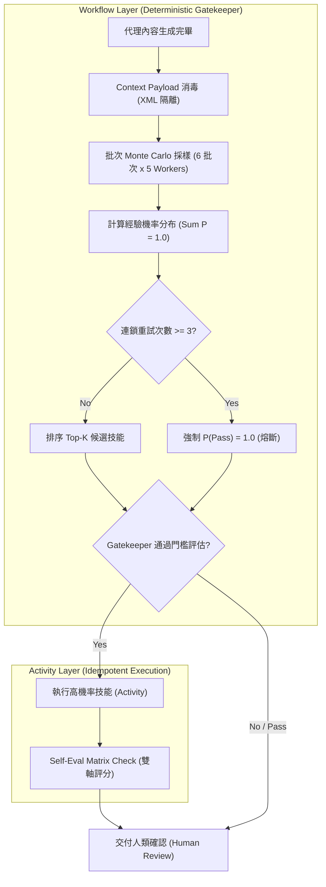

# Agent Workflow Probability Skills Pick & Orchestration Patterns

## 1. 核心定義與母群體範疇 (Skill Population & Sample Space)

本文件定義基於 **Matt Pocock (`mattpocock/skills`)** 技能生態系的機率性技能預測與工作流編排架構 (Workflow Orchestration Patterns)。

### 技能母群體 (Population of ~30+ Skills)

- **總數**: 樣本空間 $S$ 包含約 30+ 項標準技能。
- **調用模式**:
  1. **使用者主動啟動 (User-Triggered)**: 使用者透過對話或 Slash Command 直接觸發。
  2. **代理主動調用 (Agent-Autonomous)**: 代理在執行過程中由 Gatekeeper 自動評估並調用。

---

## 2. 數理機率模型與硬體邊界 (Probability & Safety Architecture)

### 1. 樣本空間與機率總和約束

定義所有可用技能集合為樣本空間 $S = \{\text{Skill}_1, \text{Skill}_2, \dots, \text{Skill}_M, \emptyset\}$，其中 $\emptyset$ 表示「選不出來 / 無需調用技能」。

機率總和約束恆成立：
$$\sum_{i \in S} P(\text{Skill}_i) = 1.0$$

### 2. 批次 Monte Carlo 30 次模擬採樣 (Batched Monte Carlo Sampling)

為防止 API Rate Limit (HTTP 429)，將 30 次模擬改為 **6 批次 $\times$ 5 並列 Workers** 執行：

- **模擬條件**: 次級代理僅評估當前產出內容與任務狀態，**僅選擇下一個建議技能，不實際執行該技能**。
- **經驗機率計算公式**:
  $$P(\text{Skill}_k) = \frac{n_k}{N} \quad (N = 30 \text{ 次模擬}, \; n_k = \text{Skill}_k \text{ 被選中的次數})$$

---

## 3. 防禦性安全與無限迴圈熔斷 (Safety & Security Controls)

> [!CAUTION]
> **無限迴圈熔斷 (Fix S-1)**: 當連鎖 `Phase Rewind` 或 `In-Phase Retry` 次數 $\ge 3$ 次，系統強制設定 $P(\emptyset) = 1.0$，暫停自動推進並立即交由人類審核。

> [!IMPORTANT]
> **Prompt Injection 隔離 (Fix SEC-1)**: 所有輸入文本包覆於 `<context_payload>` XML 標籤中，過濾控制字元，並於輸出前執行白名單過濾。

---

## 4. 技能動作分類學 (Skill Action Taxonomy)

| 動作類別 | 說明 | 代表技能範例 |
| :--- | :--- | :--- |
| **1. 順向推進 (Forward Step)** | 理論上的下一階段技能，推進流程至驗證或審查 | `verification-before-completion`, `requesting-code-review` |
| **2. 回頭重做 (Phase Rewind)** | 跨階段倒退，重新發起需求、計畫或研究 | `writing-plans`, `brainstorming`, `research` |
| **3. 本階段重試 (In-Phase Retry)** | 目前階段失敗或品質未達標，換策略重試 | `systematic-debugging`, `diagnosing-bugs`, `TDD` |
| **4. 空選擇 (Pass / Null Choice)** | 機率未達門檻、超過重試上限或無需技能，直接交付人類 | $\emptyset$ (Direct Handoff to Human) |

---

## 5. 工作流編排架構 (Temporal-Style Orchestration)



---

## 6. 統一 JSON 與 UI 雙輸出 Schema

### A. API JSON Payload

```json
{
  "total_samples": 30,
  "consecutive_rewinds": 0,
  "top_skills": [
    {
      "rank": 1,
      "skill_en": "verification-before-completion",
      "action_type": "Forward Step",
      "sample_count": 12,
      "probability": 0.40,
      "reason_zh_TW": "產出包含程式碼，交付人類前必須執行驗證指令。"
    }
  ]
}
```

### B. 人類 UI 顯示表格

| 排名 | 技能名稱 (Skill Name) | 動作類別 (Action Type) | 模擬次數 $n_k$ | 經驗機率 $P$ | 選擇原因 (zh-TW Rationale) |
| :---: | :--- | :--- | :---: | :---: | :--- |
| 1 | **verification-before-completion** | Forward Step | 12 | 40.0% | 產出包含程式碼，交付人類前必須執行驗證指令。 |
| 2 | **self-eval** | Forward Step | 8 | 26.7% | 執行雙軸評分矩陣，客觀評估本次任務品質。 |
| 3 | **systematic-debugging** | In-Phase Retry | 5 | 16.7% | 部分邏輯未完全收斂，建議於當前階段重試除錯。 |
| 4 | **writing-plans** | Phase Rewind | 3 | 10.0% | 當前結果偏離原需求，建議退回計畫階段重新擬定。 |
| 5 | **Pass ($\emptyset$)** | Pass Choice | 2 | 6.6% | 品質已達標且無特殊風險，直接交付人類確認。 |
| **合計** | **全母群體 $S$** | - | **30** | **100.0%** | **樣本空間機率總合恆為 1.0** |
