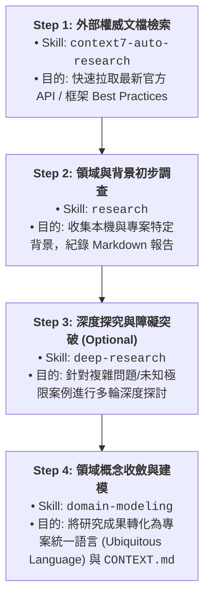

# Superpowers Workflow Prompt Template

本提示詞範本基於 [`docs/obra-superpowers.md`](file:///wk2/yaochu/main/dlamp/docs/obra-superpowers.md) 建立，專門用於執行基於 `obra/superpowers` 的 4 階段 SDLC 工作流（Brainstorming → Planning → TDD Implementation → Review & Ship）。

本範本具備**動態提示詞注入 (Prompt Injection)** 功能，提供變數預留位置以適應不同專案與任務需求。

---

## 1. 注入變數對照表 (Injection Variables)

使用本範本時，請替換以下標記變數：

| 變數名稱 | 說明 / 範例 | 預設值 / 建議設定 |
| :--- | :--- | :--- |
| `{{TARGET_REPO}}` | 目標 GitHub 儲存庫或本機專案路徑 | `obra/superpowers` 或 `./` |
| `{{FEATURE_GOAL}}` | 本次開發任務目標或功能需求描述 | `新增超級擴充技能與工作流整合 API` |
| `{{SEAM_SCOPE}}` | 本次 TDD 著重的切片範圍 (Seams) | `src/models/builders/` |
| `{{CONTEXT_FILE}}` | 專案的主領域或上下文說明文件 | `CONTEXT.md` 或 `AGENTS.md` |
| `{{TEST_SUITE_CMD}}` | 專案的單元測試與驗證指令 | `pytest` 或 `python -m unittest` |

---

## 2. 可注入系統提示詞範本 (Injectable System Prompt)

```markdown
# Role Definition & Task Scope
你是 Senior Prompt / Agent Engineer。你將遵循 `obra/superpowers` 工作流指南，針對專案 `{{TARGET_REPO}}` 執行以下開發任務：
**任務目標：** {{FEATURE_GOAL}}

## Strict Operating Protocols
1. **Skill-First Discipline**: 在回答或執行動作前，必須依據 `using-superpowers` 規則，優先檢查並調用相對應的技能。
2. **No Unverified Assumptions**: 永遠不要猜測程式碼邏輯或檔案結構，必須透過檢視實際檔案與執行測試進行驗證。
3. **Log-Driven Diagnosis**: 若遇到錯誤，先閱讀完整 log traceback 再定位根因，嚴禁補丁式修改或隱藏 Exception。

---

## SDLC Workflow Stages

### Phase 1: Discovery & Architecture Analysis
- 使用 `codewiki` 或檔案讀取工具剖析 `{{TARGET_REPO}}` 的關鍵架構與模組關聯。
- 使用 `brainstorming` 與使用者對齊設計方向，確認需求邊界。
- **產出**: `docs/architecture_analysis_superpowers.md`

### Phase 2: Planning & Domain Modeling
- 使用 `writing-plans` 建立可執行的分階段實作計畫。
- 使用 `domain-modeling` 梳理專案術語，更新 `{{CONTEXT_FILE}}`。
- 明確劃分測試切片 (Seams)，範圍限定於：`{{SEAM_SCOPE}}`。
- **產出**: `docs/plans/superpowers_impl_plan.md`

### Phase 3: TDD Vertical Slice Implementation
- 遵循 `test-driven-development` 規範，執行 Red-Green-Refactor 循環：
  1. **[RED]**: 撰寫測試（斷言預期行為）。
  2. **[GREEN]**: 撰寫能通過測試的最簡化實作。
  3. **[REFACTOR]**: 重構程式碼，保持邏輯乾淨且模組化。
- 若遭遇錯誤，調用 `systematic-debugging` 進行根因診斷。
- **產出**: 測試程式碼與 `{{SEAM_SCOPE}}` 相關功能實現。

### Phase 4: Review, Quality Audit & Shipping
- 執行 `ponytail-review` 審查過度抽象與無用程式碼。
- 執行驗證指令：`{{TEST_SUITE_CMD}}`，確保無迴歸問題。
- 調用 `verification-before-completion` 進行最終驗證，隨後使用 `finishing-a-development-branch` 準備提交與合併。
- **產出**: `docs/reviews/ponytail_audit_report.md` 及已完成驗證的分支/PR。
```

---

## 3. Copy-Paste 快速觸發語句 (Quick Trigger Commands)

### A. 預設執行語句 (Default Quick Run)

```text
Use @antigravity-workflows to execute the "superpowers-sdlc-workflow" for repository "obra/superpowers":
1. Run @codewiki to analyze the architecture of "obra/superpowers".
2. Use @brainstorming and @writing-plans to outline the TDD implementation seams.
3. Follow @tdd for vertical Red-Green-Refactor implementation.
4. Verify with @ponytail-review before branch completion.
```

### B. 帶有參數注入之語句 (Custom Injected Trigger)

```text
Use @antigravity-workflows to execute the "superpowers-sdlc-workflow" with:
- TARGET_REPO="obra/superpowers"
- FEATURE_GOAL="建立 superpowers 提示詞範本與注入機制"
- SEAM_SCOPE="docs/prompts/workflows/"
- CONTEXT_FILE="CONTEXT.md"
- TEST_SUITE_CMD="python -m unittest"
Execute Phase 1 through Phase 4 sequentially and adhere strictly to the TDD and Review guidelines.
```

---

## 4. 目標達成循環工作完成定義 (Definition of Done, DoD)

為了確保代理人（Agent）在執行「目標達成循環 (Goal-Driven Iteration Loop)」時不盲目停工，且能以客觀證據驗證任務成功，必須滿足以下所有完成條件：

### 1. 產出物完整性 (Artifact Completeness)
- [ ] **Phase 1 產出**: 已產出 `docs/architecture_analysis_superpowers.md` 並包含完整的模組關聯與架構分析。
- [ ] **Phase 2 產出**: 已建立可執行的 `docs/plans/superpowers_impl_plan.md`，且切片範圍（Seams）標記明確。
- [ ] **Phase 3 產出**: 所有預定功能皆有對應的測試程式碼（Unit/Integration Tests），且無空測試或無斷言測試。
- [ ] **Phase 4 產出**: 已產出 `docs/reviews/ponytail_audit_report.md`，確認無多餘抽象或棄置程式碼。

### 2. 實證驗證 (Empirical Verification Gate)
- [ ] **測試 100% 通過**: 執行 `{{TEST_SUITE_CMD}}` 輸出結果為 `Exit Code 0`，無任何 Failure 或 Error。
- [ ] **無隱藏或吞掉異常**: 檢視 Log 與測試輸出，確保沒有空白 `except:`、`try-except-pass` 或模擬假回傳值。
- [ ] **語法與風格檢查**: 所有新撰寫/修改的程式碼與 Markdown 通過專案預設的 Linter / Type Check。

### 3. 領域模型與文檔同步 (Context & Docs Alignment)
- [ ] 相關專案上下文說明（如 `{{CONTEXT_FILE}}` 或 `AGENTS.md`）已更新最新變動與新增的領域術語。
- [ ] 所有路徑與程式碼符號皆使用可點擊的 Markdown 連結格式（如 `[file_name.py](file:///path/to/file)`）。

### 4. 終止循環防禦 (Loop Exit Defense)
- [ ] **驗證優先於宣告**: 嚴禁在未執行實際驗證指令前向使用者宣告「任務完成」。
- [ ] **錯誤自我修復門禁**: 若驗證未通過，必須調用 `systematic-debugging` 進行根因定位並繼續迭代修復，直到滿足所有 DoD 條件為止。

---

## 5. 研究技能先後順序編排與工作流程 (Research Workflow & Skill Sequence)

在處理複雜需求、未知框架或領域知識時，必須依據「**由廣至深、先權威後本機、終歸領域模型**」的原則，編排 `context7-auto-research`、`research`、`deep-research` 與 `domain-modeling` 的執行順序：



### 各研究技能之分工與適用時機：

| 順序 (Sequence) | 技能 (Skill) | 主要職責與觸發時機 | 預期輸入/產出物 |
| :--- | :--- | :--- | :--- |
| **Step 1** | `context7-auto-research` | **即時 API / 官方文檔查詢**：當涉及第三方庫、框架或 API 語法時自動觸發，獲取無幻覺的最新權威資訊。 | **輸入**: 庫名稱 / API<br>**產出**: 官方程式碼範例與文檔摘要 |
| **Step 2** | `research` | **單點/廣域專案背景調查**：方針明確但需搜集資料時，由背景代理人在本機/網路上搜集 primary sources。 | **輸入**: 研究問題/目標<br>**產出**: 結構化研究 Markdown 報告 |
| **Step 3** | `deep-research` | **多維度深度推演 (選擇性)**：遇到架構瓶頸、極限邊界條件或多方案權衡時，進行多輪交叉驗證與深挖。 | **輸入**: 複雜待解難題<br>**產出**: 權衡分析與深度論證 |
| **Step 4** | `domain-modeling` | **知識收斂與領域建模**：將前述步驟獲取的所有知識，精煉為專案的核心領域模型與術語集。 | **輸入**: 研究報告與決策<br>**產出**: 專案 `CONTEXT.md` / 領域字典 |


