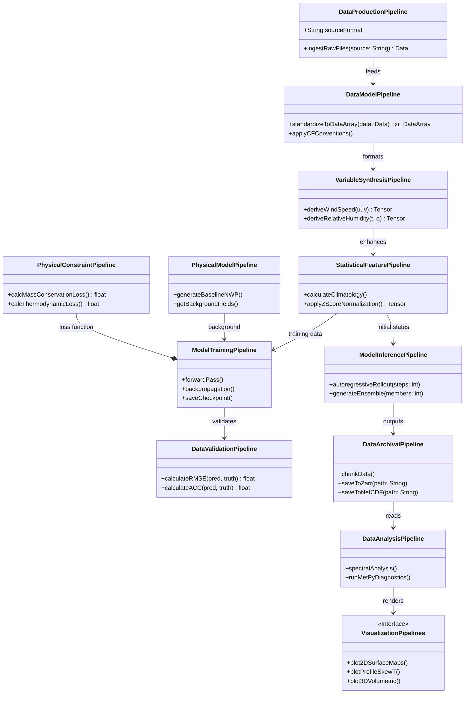
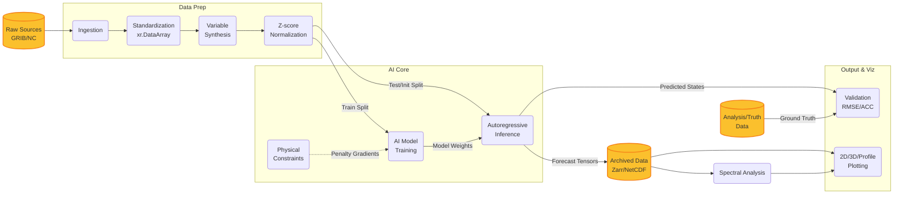
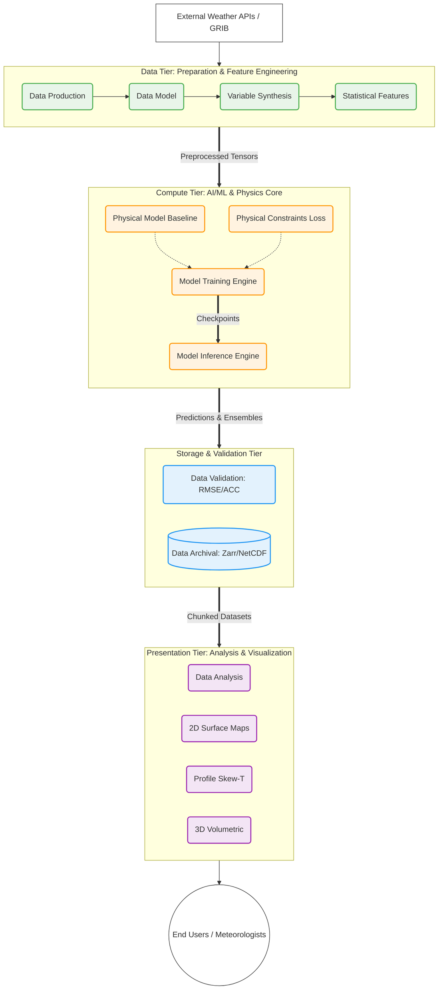

# ML-Weather Prediction System Architecture Diagram

## Machine Learning Weather Prediction (MLWP) 系統架構

這是一套針對您提供的 **MLWP (Machine Learning Weather Prediction) 系統架構** 所設計的 Mermaid 圖表集合。

為了全面展示這個 AI/ML 專案，我為您繪製了四種不同視角的圖表：**元件圖 (Component Diagram)**、**類別圖 (Class Diagram)**、**資料流程圖 (Data Flow Diagram, DFD)** 以及 **系統架構圖 (Architecture Diagram)**。

---

### 1. 元件圖 (Component Diagram)

**目的**：展示系統的模組化結構，以及各個子系統（Pipeline）如何被組織在不同的分層（Layers）中。
**設計**：使用帶有子圖 (subgraph) 的流程圖來呈現分層架構，並加入自訂樣式以區分不同層級。

```mermaid
%%{init: {'theme': 'base', 'themeVariables': { 'primaryColor': '#e1f5fe', 'edgeLabelBackground':'#ffffff'}}}%%
graph TB
    %% 定義樣式
    classDef layerStyle fill:#f8f9fa,stroke:#ced4da,stroke-width:2px,rx:10,ry:10;
    classDef compStyle fill:#ffffff,stroke:#4dabf7,stroke-width:2px,color:#333;
    
    subgraph Layer1 [1. Data Preparation Layer]
        DPP[Data Production Pipeline<br/>Ingest GRIB/NC]:::compStyle
        DMP[Data Model Pipeline<br/>Standardize xr.DataArray]:::compStyle
        VSP[Variable Synthesis Pipeline<br/>Derive Physical Quantities]:::compStyle
        SFP[Statistical Feature Pipeline<br/>Climatology & Z-score]:::compStyle
    end

    subgraph Layer2 [2. Modeling and Core Layer]
        PMP[Physical Model Pipeline<br/>Baseline NWP]:::compStyle
        PCP[Physical Constraint Pipeline<br/>Mass/Thermo Penalties]:::compStyle
        MTP[Model Training Pipeline<br/>AI Forward/Backprop]:::compStyle
        MIP[Model Inference Pipeline<br/>Autoregressive Rollout]:::compStyle
    end

    subgraph Layer3 [3. Validation and Archival Layer]
        DVP[Data Validation Pipeline<br/>RMSE, ACC Metrics]:::compStyle
        DAP[Data Archival Pipeline<br/>Zarr/NetCDF Chunking]:::compStyle
    end

    subgraph Layer4 [4. Analysis and Visualization Layer]
        DAnP[Data Analysis Pipeline<br/>Spectral/CDO/MetPy]:::compStyle
        Plot2D[2D Plotting Pipeline<br/>Surface/Contours]:::compStyle
        PlotProf[Profile Plotting Pipeline<br/>Skew-T/Cross-sections]:::compStyle
        Plot3D[3D Plotting Pipeline<br/>Volumetric Isosurfaces]:::compStyle
    end

    %% 元件之間的依賴關係
    Layer1 --> Layer2
    Layer2 --> Layer3
    Layer3 --> Layer4

    class Layer1,Layer2,Layer3,Layer4 layerStyle;
```

---

### 2. 類別圖 (Class Diagram)

**目的**：以物件導向 (OOP) 的視角，展示各個 Pipeline 的內部方法（Functions）與職責，以及它們之間的關聯性。
**設計**：將括號內的描述轉換為類別的方法 (Methods) 與屬性 (Attributes)。

---

### 3. 資料流程圖 (Data Flow Diagram, DFD)

**目的**：追蹤氣象資料（如 GRIB/NC）從原始輸入，經過特徵工程、模型訓練/推論，直到最終視覺化與儲存的生命週期。
**設計**：使用由左至右 (`LR`) 的方向，並使用圓柱體圖形表示資料庫/儲存節點。

---

### 4. 系統架構圖 (Architecture Diagram)

**目的**：提供高階的系統鳥瞰圖，適合放在專案的 README 或架構文件中。強調各個模組在整個基礎設施中的定位。
**設計**：採用區塊與顏色管理，區分「資料層」、「核心運算層」、「儲存與驗證層」及「展示層」。

### 💡 Mermaid 專家建議與最佳實踐 (Best Practices)

1. **渲染環境**：這些圖表使用了標準的 Mermaid 語法，在 GitHub, GitLab, Notion 或 Obsidian 中皆可完美渲染。
2. **樣式自訂 (Styling)**：在架構圖與元件圖中，我使用了 `classDef` 來定義顏色。這有助於在複雜的 AI 專案中，一眼區分出「資料處理 (綠)」、「模型運算 (橘)」、「儲存 (藍)」與「視覺化 (紫)」。
3. **擴充性**：如果未來您的專案加入了 MLOps (如 MLflow, Weights & Biases) 或分散式訓練 (DDP, Ray)，可以直接在 **Compute Tier (T2)** 中新增節點，架構圖依然能保持整潔。
