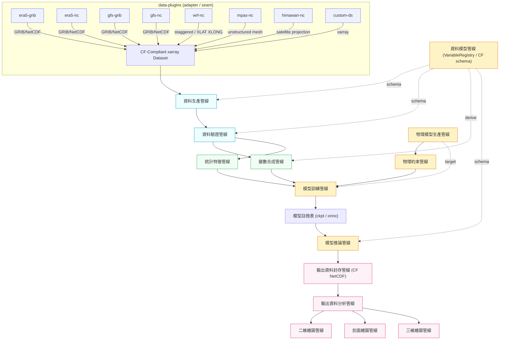
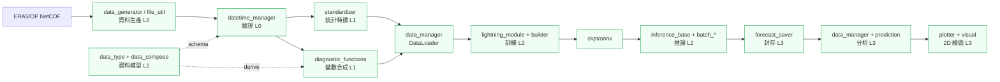

# MLWP 通用 AI/ML 氣象模式 — 管線架構設計

本文件定義 MLWP 系統（主專案核心介面 + data-plugins 模組）的 AI/ML 工作流程、14 條管線的階層關係，以及完整的資料流向。

## 0. 核心設計約束

- **資料核心介面**：全域以 `xarray.DataArray / Dataset` 為唯一資料交換型式。
- **CF-Conventions**：所有變數、座標、單位須符合 CF 標準名稱（`standard_name` / `units` / `cell_methods`）。
- **data-plugins**：負責把各外部格式無縫轉換為 CF-compliant 的 xarray 物件，是資料進入系統的第一道 **adapter / seam**。

---

## 1. Core 與 Optional 的 AI/ML 工作流程

### 1.1 必須具備（Core）

| 工作流程 | 說明 |
| --- | --- |
| **資料內嵌與正規化** | data-plugins 讀取多源格式 → 統一為 CF xarray，正規化座標（time/lat/lon/level）與變數命名 |
| **資料驗證** | 對進入系統的資料做 schema / range / 缺失 / 連續性檢查，確保餵入下游的資料是乾淨的 |
| **特徵工程** | 統計特徵（標準化、氣候氣候態、衍生量）與變數合成（診斷量、物理關聯量） |
| **模型訓練** | 從版本化資料集訓練、追蹤實驗、產出模型成品與 metadata |
| **模型推論** | 以訓練模型對新輸入做自動迴歸 / 機率預測，產出 forecast 張量 |
| **輸出封存與分析** | 把推論結果寫成 CF NetCDF 並做事後評估 / 診斷 |
| **視覺化** | 2D / 剖面 / 3D 繪圖（由輸出分析驅動） |

### 1.2 選配（Optional）

| 工作流程 | 說明 |
| --- | --- |
| **物理模型生產** | 整合 / 銜接外部物理模式（WRF、MPAS、GFS）輸出，作為背景態或目標資料 |
| **物理約束** | 在訓練 / 推論加入物理一致性的正規項（守恆、地轉平衡、平滑） |
| **線上即時推論** | 低延遲串流推論與模型滾動更新（視部署環境啟用） |
| **超參數調校** | 自動化 HPO（Optuna / Ray） |
| **模型監控** | 資料漂移 / 概念漂移偵測、自動回滾 |

---

## 2. data-plugins 對不同格式的處理機制

所有 plugin 的共同契約：`load(path) -> xarray.Dataset (CF-compliant)`。每支 plugin 內部完成「格式解碼 → 座標建構 → 座標正規化 → 變數對映 CF → 單位/網格處理 → 驗證」六步。

| Plugin | 來源格式 | 處理機制 | 特殊處理 |
| --- | --- | --- | --- |
| `era5-grib` | GRIB1/2 | cfgrib + eccodes 解碼；GRIB `paramId` → CF `standard_name` 對映 | 水平 / 垂直座標重建；混合氣壓座標 (hybrid) 解算 |
| `era5-nc` | NetCDF | xarray 直接開檔；變數名 / 座標對映 CF | 同 era5 變數既有命名，僅需 alias 對映 |
| `gfs-grib` | GRIB2 | cfgrib + eccodes；GRIB2 網格規格（latlon / gaussian）建構座標 | 網格點 → CF 網格；isobaric 高度座標 |
| `gfs-nc` | NetCDF | xarray 開檔；`time1/time2` 等 GFS 慣用座標正規化 | forecast 有效時間（valid time）重建 |
| `wrf-nc` | WRF NetCDF | xarray 開檔；`XLAT/XLONG` 建構 2D 座標；`Times` 字串解析時間 | WRF 慣用名（如 `T` 為 perturbation）→ CF；交錯網格 (staggered) 去交錯 |
| `mpas-nc` | MPAS NetCDF | 非結構化網格（cells/vertices）；以 xugrid/ugrid 讀取拓撲 | 非結構化網格 → 規則網格重取樣（interpolate） |
| `himawari-nc` | 衛星開窗 NetCDF | xarray 開檔；衛星投影網格（GOES 固定投影 / 視場）處理 | 投影座標 → 經緯度點（`reproject`）；填雲 / 缺值遮罩 |
| `custom-ds` | 使用者自訂 | 只要是 xarray 相容即可載入；交由 contract 校驗 | 使用者須通過插件 schema contract 才能放行 |

統一產出：每支 plugin 不必知道下游用途，只負責把自己那份格式變成一個乾淨的 CF xarray Dataset —— 這是一個典型的 **隱藏在 deep seam 後方的 adapter**，下游對格式零感知。

---

## 3. 14 條管線階層關係表

階層屬性欄位以 **層級（Level 0–3）** + **上游/下游相依** 表達。歸類：

- **L0 資料元件層**：資料生產、資料驗證
- **L1 特徵層**：變數合成、統計特徵
- **L2 模式層**：資料模型、物理模型生產、物理約束、模型訓練、模型推論
- **L3 產出層**：輸出封存、輸出分析、2D / 剖面 / 3D 繪圖

| 管線名稱 | 管線描述 | 管線架構 | 管線功能 | 管線元件 | 管線 IO 介面 | 階層屬性 |
| --- | --- | --- | --- | --- | --- | --- |
| 資料生產管線 | 從 data-plugins 讀取多源原始資料，正規化為 CF xarray | reader-adapter pipeline | 格式解碼、座標正規化、變數對映 CF、單位處理 | `DataPlugin`、`CoordNormalizer`、`VarMapper`、`UnitCaster` | In: 原始檔路徑；Out: `xarray.Dataset (CF)` | **L0** 上游：無 下游：驗證 |
| 資料驗證管線 | 對任何要進入系統的資料做完整品質 / 符合性檢查 | validator pipeline | schema 檢查、範圍 / 缺失 / 連續性、與資料模型比對 | `SchemaValidator`、`RangeValidator`、`GapDetector` | In: 來源 Dataset；Out: 已驗證 Dataset + 品質報告 | **L0** 上游：資料生產 下游：特徵層 |
| 資料模型管線 | 定義且維護變數 / 座標的 canonical 定義（CF schema），作為全民鐵律 | canonical-registry | 變數註冊、CF `standard_name` 對映、單位與維度定義 | `VariableRegistry`、`CFMapper`、`DataCompose` | In: 設定 YAML；Out: 唯讀 schema（供各管線查詢） | **L2** 上游：無 下游：驗證 / 合成 / 封存 |
| 變數合成管線 | 由來源變數衍生診斷 / 物理關聯變數 | diag-functions pipeline | 衍生量計算、mixing-ratio / θ / 渦度等公式庫 | `DiagnosticRegistry`、`diag_*`、`Thermo` | In: CF Dataset；Out: 增補變數的 Dataset | **L1** 上游：驗證、資料模型 下游：訓練 |
| 統計特徵管線 | 計算並套用統計特徵（z-score、氣候態、時間特徵） | stat-feature pipeline | 標準化統計、時序 / 季節特徵注入、逆標準化 | `Standardizer`、`FeatureEncoder` | In: CF Dataset；Out: 特徵化張量 | **L1** 上游：驗證、資料模型 下游：訓練 |
| 物理模型生產管線 | 銜接外部物理模式輸出作為背景態 / 目標 | external-model adapter | 讀取 WRF/MPAS/GFS 產出、重取樣、座標對齊 | `PhysicalModelAdapter`、`Regridder` | In: 物理模式檔案；Out: 對齊後 CF Dataset | **L2** 上游：無 下游：物理約束、訓練 |
| 模型訓練管線 | 以版本化特徵資料集訓練 backbone，追蹤實驗並產出成品 | training pipeline | DataLoader、模型構建、loss/優化、實驗記錄、ckpt 產出 | `DataManager`、`Builder`、`LightningModule`、`Trainer` | In: 特徵化 ds + 訓練 cfg；Out: ckpt + metrics + registry 註冊 | **L2** 上游：特徵層、資料模型、物理約束 下游：推論 |
| 物理約束管線 | 在訓練 / 推論追加物理一致性正規化 | constraint adapter | 守恆 / 平滑 / 加權 loss、物理傾向對齊 | `PhysConstraint`、`WeightedLoss` | In: 張量 + 約束 cfg；Out: 加權 loss 項 | **L2** 上游：物理模型生產、推論 下游：訓練 / 推論 |
| 模型推論管線 | 以成品模型對輸入做自動迴歸 / 機率預測 | inference pipeline | 自動迴歸迴圈、邊界交換、ONNX/ckpt 引擎、時序特徵 | `InferenceBase`、`BatchOnnx/Ckpt`、`BoundarySwapper` | In: 特徵化輸入 + ckpt/onnx；Out: forecast 張量 | **L2** 上游：訓練、資料模型 下游：封存 |
| 輸出資料封存管線 | 將 forecast 寫成 CF NetCDF 檔案 | serde pipeline | CF 屬性寫入、座標 / 單位對映、版本化封存 | `ForecastSaver`、`NetCDFMeta` | In: forecast 張量；Out: CF NetCDF 檔 | **L3** 上游：推論、資料模型 下游：分析 |
| 輸出資料分析管線 | 對封存輸出做評估 / 診斷 / 統計彙整 | analysis pipeline | 誤差指標、與 ground truth 對比、場統計 | `MetricsCalc`、`ForecastEval` | In: NetCDF + truth；Out: 評估值 / 分析 Dataset | **L3** 上游：封存 下游：繪圖 |
| 二維繪圖管線 | 產出水平場監測圖（風、溫、位等） | 2D render pipeline | 水平場等值 / 填色、疊地形、雙變數 | `Plotter2D`、`WeatherPlotter` | In: 分析 Dataset；Out: PNG 圖 | **L3** 上游：分析 下游：— |
| 剖面繪圖管線 | 產出垂直剖面圖（緯向 / 經向 / 任意線） | cross-section pipeline | 沿路徑取樣、垂直插值、θ/Qv 計算 | `CrossSectionSampler`、`PlotterProfile` | In: 分析 Dataset + 剖面定義；Out: PNG 圖 | **L3** 上游：分析 下游：— |
| 三維繪圖管線 | 產出三維空間可視化 / 體資料 | 3D render pipeline | 體積渲染、等值面、切片動態 | `VolumeRenderer`、`Plotter3D` | In: 分析 Dataset；Out: 3D PNG/動畫 | **L3** 上游：分析 下游：— |

---

## 4. 完整的資料流 Workflow Diagram

### 資料流重點

1. **所有資料必先過 data-plugins**，抵達系統的第一站即已 CF 化，下游 8 支 plugin 對格式零感知。
2. **資料模型管線是橫向鐵律**：以 `VariableRegistry` 同時約束驗證（schema）、合成（衍生定義）、推論（IO）、與封存（CF 屬性）。
3. **兩條支流**：觀測/再分析流（production→validation）與物理模式流（physical-model），於訓練與物理約束交匯。
4. **單一出口**：推論 → 封存 → 分析 → 三條繪圖，全從封存的 CF NetCDF 出發，保證繪圖資料與封存資料一致。

---

## 5. 設計要點（對應 deepen 原則）

- **data-plugins = adapter 於 seam**：8 支 plugin 存在即證明 seam 真實，介面 `load()→CF Dataset` 小而深，格式邏輯全部藏於其後（locality）。
- **資料模型管線是 deep module**：小介面（registry 查詢 + `DataCompose`）背後藏著 CF 對映、單位、維度、衍生定義（leverage：一支 schema 服務所有下游）。
- **`Thermo` / `Standardizer` 為共用 deep module**：把散落的物理與統計公式收斂，單點修正、單點測試。

---

## 6. MLWP 管線 → dlamp 既有程式碼對映

將上述通用架構對映到本 repo（`src/dlamp/`）。注意：**dlamp 目前只實現 CP（再分析 ERA5/OP）單一資料來源 + Pangu/Glide 單一模型**，故「多源 data-plugins」與部分繪圖是**未實現／部分實現**。

### 6.1 對映表

| MLWP 管線 | dlamp 實作模組 | 狀態 |
| --- | --- | --- |
| 資料生產管線 | `utils/data_generator.py`（`DataGenerator`）、`utils/file_util.py`（`gen_path`/`gen_data`/`read_cwa_ncfile`）、`data/preproc/cds_downloader.py`、`data/preproc/dlamp_regridder.py` | ✅ 已實現（僅 OP 來源） |
| 資料驗證管線 | `managers/datetime_manager.py`（`sanity_check` 檔存在檢查）、`const.py`（`BLACKLIST_PATH`） | ⚠️ 部分（檔存在性，非 CF schema） |
| 資料模型管線 | `utils/data_type.py`（`DataType`/`Level`）、`utils/data_compose.py`（`DataCompose`）、`const.py`（`DataCompose` 定義） | ✅ 已實現（canonical registry） |
| 變數合成管線 | `data/registry/diagnostic_functions.py`（`diag_*`）、`data/registry/diagnostic_registry.py` | ✅ 已實現 |
| 統計特徵管線 | `standardizer.py`（`Standardizer` z-score + Qt log 轉換）、`utils/time_util.py`（時間特徵 sin/cos） | ✅ 已實現 |
| 物理模型生產管線 | 無（dlamp 以再分析為目標，非外部物理模式產出） | ⛔ 未實現 |
| 模型訓練管線 | `models/builders/{base,pangu,glide}_builder.py`、`models/lightning_modules/{pangu,diffusion}_lightning_module.py`、`managers/data_manager.py`、`train.py` | ✅ 已實現 |
| 物理約束管線 | `models/loss_fn/{crps,euclidean}.py`、`models/architectures/smoothing.py` | ⚠️ 部分（loss，非物理守恆） |
| 模型推論管線 | `inference/inference_base.py`、`inference/batch_inference_{onnx,ckpt}.py`、`inference/infer_utils.py`、`export_onnx.py` | ✅ 已實現 |
| 輸出資料封存管線 | `analysis/forecast_saver.py`、`analysis/netcdf_meta.py` | ✅ 已實現 |
| 輸出資料分析管線 | `analysis/data_manager.py`（`AnalysisDataManager`）、`analysis/prediction.py`（`PredictionRunner`） | ✅ 已實現 |
| 二維繪圖管線 | `analysis/plotter.py`（`WeatherPlotter` 12-panel）、`visual/viz_{gph,temp,wind,vor,...}.py`、`visual/tw_background.py` | ✅ 已實現 |
| 剖面繪圖管線 | `analysis/plotter.py`（`create_cross_section_figure`） | ⚠️ 存在但無呼叫（dead code，且讀 `manager.levels` 會 `AttributeError`） |
| 三維繪圖管線 | 無 | ⛔ 未實現 |

### 6.2 對映後的缺口與深化機會（呼應架構審查）

1. **資料生產管線非多源 adapter**：dlamp 的 `file_util.py` 用 `match data_source` 三個獨立表（`gen_data`/`gen_path`/`datetime_manager.sanity_check`）而**非 data-plugins 式 deep seam**。要在 `era5-grib / gfs-nc / mpas-nc` 等 8 來源擴充，需收斂為 `DataSource` 模組（adapter 於 seam）——即審查 Candidate #4。
2. **資料模型管線（VariableRegistry）是現成 deep module**：`DataType`/`DataCompose` 已達成 CF 對映與單位收斂，是唯一符合「資料模型管線」設計的模組，可作為其餘管線的 schema 鐵律。
3. **變數合成管線（`Thermo`）公式散落**：mixing-ratio / 飽和水氣壓在 `diagnostic_functions.py` 與 `analysis/data_manager.py` 重複推導，且 ERA5 只加總 4/5 水凝物種——即審查 Candidate #5。
4. **模型推論管線重複**：`batch_inference_onnx` 與 `batch_inference_ckpt` 的 `infer()` 迴圈僅模型呼叫不同——即審查 Candidate #1。
5. **剖面繪圖是死碼且含 bug**：`create_cross_section_figure` 無呼叫者、讀不存在的 `manager.levels`——即審查 Candidate #6 的具體隱藏 bug。

### 6.3 對映示意（dlamp 目前實作範圍）

