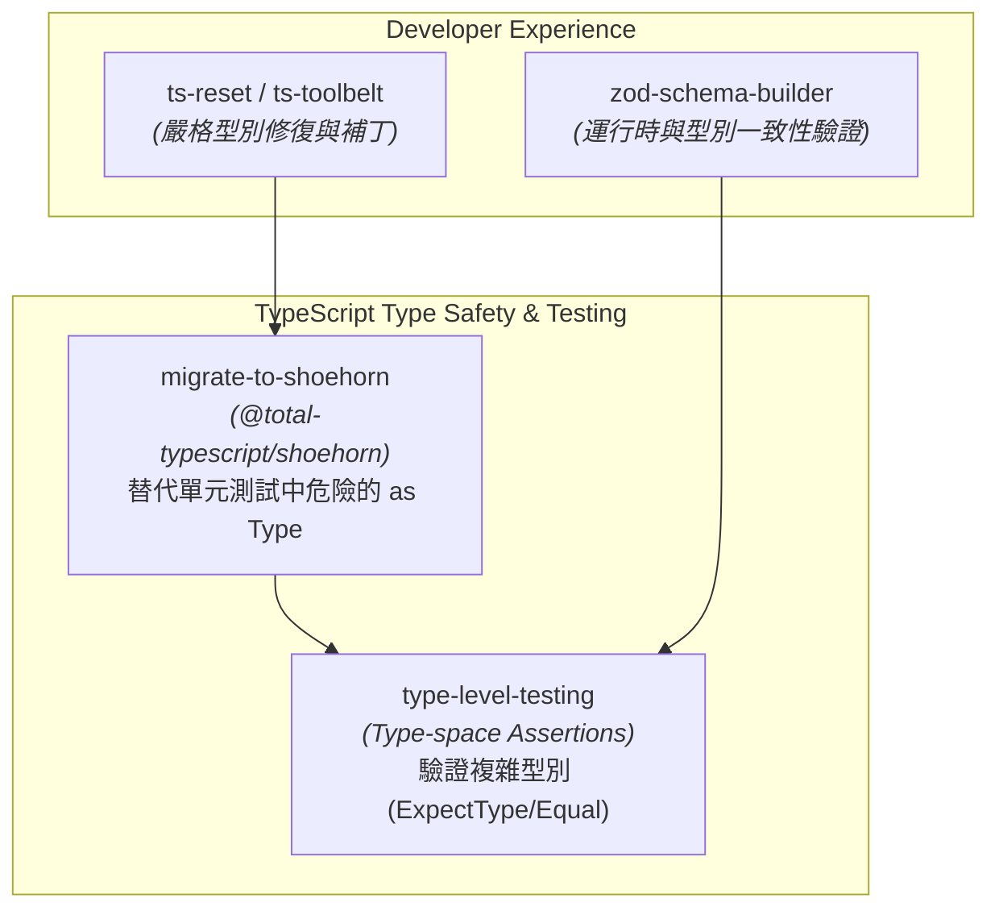
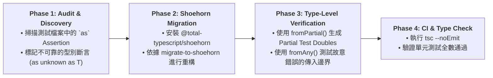

# `mattpocock/skills` Workflow 組織架構與 TypeScript 工具鏈藍圖

基於 **`@antigravity-workflows`** 與 Matt Pocock (TypeScript 社群專家) 之開源測試與型別工具庫 (如 `@total-typescript/shoehorn`)，針對 **`mattpocock/skills`** 系列構建專屬的 TypeScript 開發與型別重構工作流。

---

## 1. `mattpocock/skills` 核心技能地圖 (TypeScript Skill Map)



---

## 2. 整合工作流編排：`mattpocock-ts-testing-workflow`

使用 **`antigravity-workflows`** 將 Matt Pocock 的測試與型別導向技術組織為 4 階段標準工作流：



---

## 3. 各階段規範與產出對照

| 階段 (Phase) | 核心工具 / 技能 (Tools) | 執行任務與規範 | 預期產出與變更 (Outputs) |
| :--- | :--- | :--- | :--- |
| **Phase 1: 斷言掃描** | `grep -r " as "` | 搜尋 `.test.ts` 或 `.spec.ts` 中手動轉型與雙重轉型之位址 | 不安全斷言清單 |
| **Phase 2: Shoehorn 替換** | `migrate-to-shoehorn`<br>`fromPartial()` | 將 `payload as Request` 替換為 `fromPartial(payload)`；保留完整 IDE 自動補全與型別推導 | 測試檔案重構 ([`tests/*.test.ts`](file:///wk2/yaochu/main/dlamp/tests)) |
| **Phase 3: 邊界測試** | `fromAny()` | 針對錯誤傳參之例外測試，將 `as unknown as T` 替換為 `fromAny()` | 測試穩健性提升 |
| **Phase 4: 靜態與單元驗證** | `tsc` / `pytest` / `vitest` | 執行靜態型別檢查與測試，確保完全無 `as` assertion 殘留 | 清潔且安全的型別測試套件 |

---

## 4. Copy-Paste 執行指令 (Prompt)

若要透過代理執行 `mattpocock/skills` 整合工作流，請輸入：

```text
Use @antigravity-workflows to execute the "mattpocock-ts-testing-workflow" for TypeScript test suites:
1. Scan for "as Type" and "as unknown as Type" assertions across all test files.
2. Execute @migrate-to-shoehorn to replace unsafe assertions with fromPartial() and fromAny().
3. Verify type-checking with `tsc --noEmit` and run the unit test suite.
```

