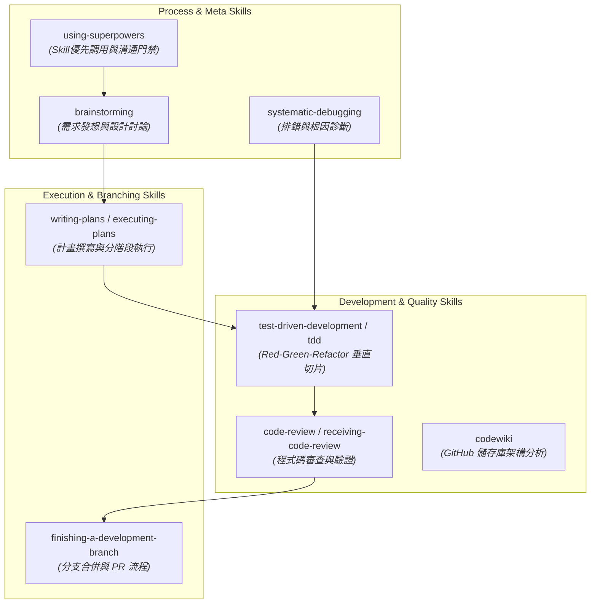
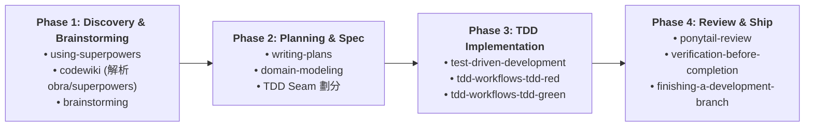

# `obra/superpowers` Workflow 組織架構與整合藍圖

基於 **`@antigravity-workflows`** 與 **`@superpowers`** (由 Jesse Vincent / `obra` 創建之 Agent 擴充技能庫)，針對 **`obra/superpowers`** 儲存庫進行架構剖析與多階段工作流編排。

---

## 1. `obra/superpowers` 核心技能地圖 (Superpowers Skill Map)



---

## 2. 整合工作流編排：`superpowers-sdlc-workflow`

使用 **`antigravity-workflows`** 將 `obra/superpowers` 的核心技能組織為 4 階段完整開發循環：



---

## 3. 各階段規範與產出對照

| 階段 (Phase) | 核心技能 (Skills) | 執行任務與規範 | 預期產出文件 (Artifacts) |
| :--- | :--- | :--- | :--- |
| **Phase 1: 需求與架構分析** | `using-superpowers`<br>`codewiki`<br>`brainstorming` | 1. 強制優先調用技能機制<br>2. 抓取 `obra/superpowers` 儲存庫 API 與模組結構<br>3. 與使用者對齊設計方向與介面需求 | `docs/architecture_analysis_superpowers.md` |
| **Phase 2: 計畫與領域建模** | `writing-plans`<br>`domain-modeling` | 1. 撰寫可執行的分階段實作計畫<br>2. 定義領域術語並更新 `CONTEXT.md`<br>3. 確定測試公共邊界 (Seams) | `docs/plans/superpowers_impl_plan.md`<br>`CONTEXT.md` |
| **Phase 3: TDD 垂直切片開發** | `tdd`<br>`systematic-debugging` | 1. [RED] 撰寫 seam 測試與 assertion<br>2. [GREEN] 最簡化程式碼實現<br>3. 遇錯即時診斷根因而非吞掉 Exception | `tests/test_superpowers_*.py`<br>`src/dlamp/` 相關模組 |
| **Phase 4: 審查與交付** | `ponytail-review`<br>`finishing-a-development-branch` | 1. 執行 ponytail-review 審查多餘過度抽象<br>2. 驗證 `make check && make test`<br>3. 完成 Git commit / PR 合併準備 | `docs/reviews/ponytail_audit_report.md` |

---

## 4. Copy-Paste 執行指令 (Prompt)

若要透過代理執行 `obra/superpowers` 整合工作流，請輸入：

```text
Use @antigravity-workflows to execute the "superpowers-sdlc-workflow" for repository "obra/superpowers":
1. Run @codewiki to analyze the architecture of "obra/superpowers".
2. Use @brainstorming and @writing-plans to outline the TDD implementation seams.
3. Follow @tdd for vertical Red-Green-Refactor implementation.
4. Verify with @ponytail-review before branch completion.
```


