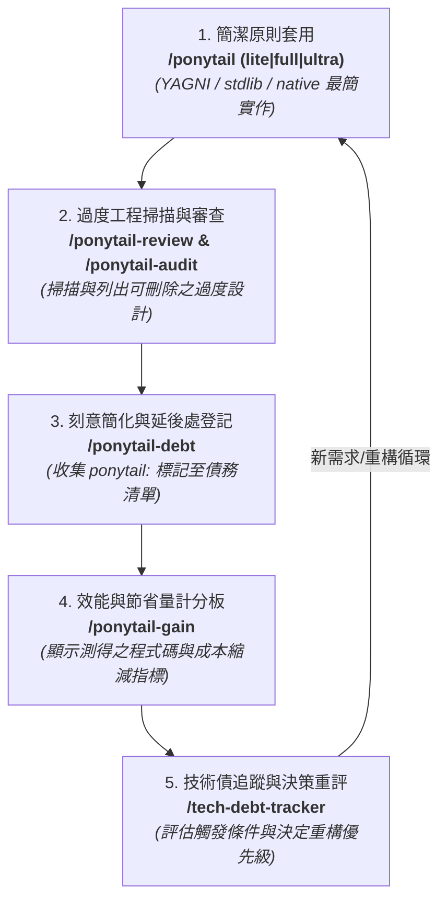

# Ponytail 簡潔開發與技術債持續循環工作流 (Continuous Ponytail Cycle)

使用 **`@antigravity-workflows`** 將一系列 **Ponytail** 技能（包含程式碼精簡、過度工程審查、技術債追蹤與效益檢視）組織為**連續閉環循環 (Continuous Feedback Loop)**。

---

## 1. 連續循環流程圖 (Continuous Cycle Workflow)



---

## 2. 各階段技能職責與調用介面

| 階段 | 技能名稱 | 觸發指令 | 階段任務與產出 |
| :--- | :--- | :--- | :--- |
| **Step 1: 簡潔實作** | **`ponytail`** | `/ponytail` | 遵循 YAGNI 原則，使用 Python 標準庫或原生功能實作最簡可行方案。 |
| **Step 2: 過度工程審查** | **`ponytail-review` / `ponytail-audit`** | `/ponytail-review`<br>`/ponytail-audit` | 針對增量 (diff) 或全專案進行過度工程掃描，輸出 `L<line>: <tag> <what>. <replacement>.` 一行化建議與 `net: -N lines` 統計。 |
| **Step 3: 債務登記** | **`ponytail-debt`** | `/ponytail-debt` | 掃描專案中所有的 `ponytail:` 註記（例如 `# ponytail: ceiling, upgrade_trigger`），匯出成 `PONYTAIL-DEBT.md` 技術債帳冊。 |
| **Step 4: 效益檢視** | **`ponytail-gain`** | `/ponytail-gain` | 輸出包含代碼量縮減 (6–20%)、成本降低與速度提升 (3–6× faster) 的基準計分板。 |
| **Step 5: 債務追蹤** | **`tech-debt-tracker`** | `/tech-debt-tracker` | 使用 WSJF / Cost-of-Delay 框架評估過期或需要升級的技術債，決定是否進入下一輪 `/ponytail` 精簡與重構。 |

---

## 3. 自動化執行手冊 (Antigravity Workflow Definition)

若要在 Antigravity 代理中一鍵啟動此連續循環，請使用以下指令：

```text
Use @antigravity-workflows to run the "Continuous Ponytail Clean Code & Debt Cycle":
1. Execute /ponytail-audit to scan for redundant abstractions.
2. Execute /ponytail-debt to compile current ponytail: comments into a ledger.
3. Execute /ponytail-gain to display productivity and efficiency benchmarks.
4. Execute /tech-debt-tracker to score and prioritize debt paydown.
```

